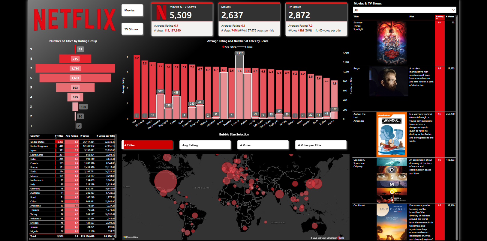
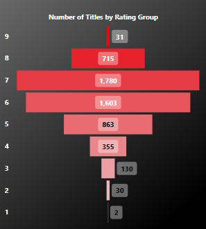
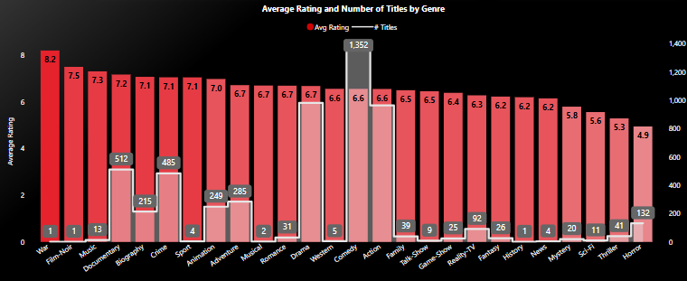
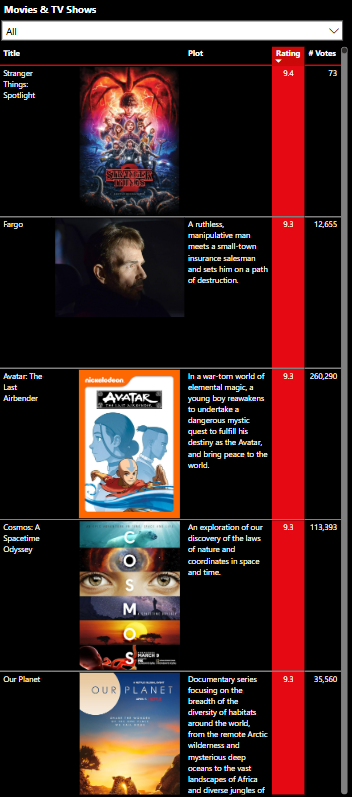
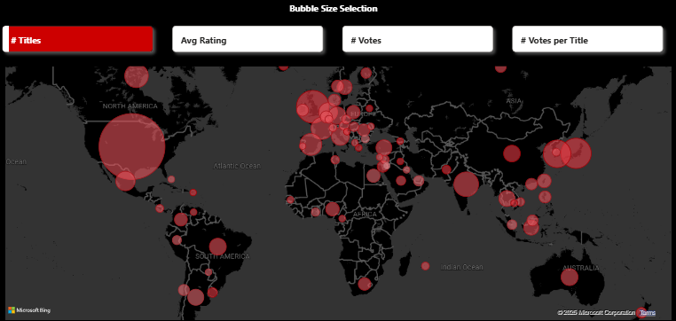

# 🎬 Netflix Power BI Dashboard

An interactive **Power BI** dashboard that analyzes Netflix's library of **Movies & TV Shows**. It offers insights into global distribution, average ratings, genre trends, and user engagement, helping users explore Netflix content from various perspectives.

## 📸 Dashboard Preview

## 📊 Key Features

- 📈 **Total Titles Analyzed:** 5,509  
  - 🎥 **Movies:** 2,637 | Avg. Rating: 6.1  
  - 📺 **TV Shows:** 2,872 | Avg. Rating: 7.2  
  - ⭐ **Total Votes:** 115M+

- 📊 **Visualizations Include:**
  - **Rating Distribution** by number of titles.
  
  

  - **Average Ratings by Genre** and number of titles.
  

  - 🎯 **Interactive Titles Explorer** — A searchable visual displaying **all Netflix Movies & TV Shows** with key details:  
    - ⭐ **Rating**  
    - 💬 **Number of Votes**  
    - 🎬 **Title & Type (Movie/TV Show)**
  
 
 
## 🌍 Global Insights
- The **United States** leads in both total titles and user votes.  
- **Comedy** and **Drama** dominate in volume, while **Documentaries** rank highest in average ratings.  
- Viewing patterns differ globally, with regions like **Asia** showing strong engagement in **Anime** and **Thriller** genres.

## 🛠️ Technologies Used

- **Power BI**  
- **DAX** (Data Analysis Expressions)  
- **Microsoft Bing Maps** for geo-visualizations  
- **Data Cleaning & Transformation** using Power Query

## 🚀 How to Use

1. **Download** the `.pbix` file from the repository.
2. **Open** the file using **Power BI Desktop**.
3. **Interact** with the filters, maps, and charts to explore the data.
4. Switch bubble sizes in the map using the options for:
   - 📌 **# Titles**  
   - ⭐ **Avg Rating**  
   - 💬 **# Votes**
   - ⭐ **Votes per Title**

## 💡 Insights Gained

- 🇺🇸 **United States** dominates Netflix's content library with the highest number of titles, followed by the **United Kingdom** and **Japan**.  
- 😂 **Comedy** and 🎭 **Drama** are the most abundant genres, catering to a wide range of audience preferences.  
- 🌍 **User voting patterns** reveal regional trends — the **US** leads in total votes, while countries like **South Korea** and **Japan** show high engagement per title.  
- 🎯 **TV Shows** slightly outperform **Movies** in average ratings (**7.2** vs. **6.1**), indicating a preference for serialized content.  
- 🗺️ The **Global Distribution Map** highlights strong Netflix footprints in **North America**, **Europe**, and parts of **Asia**, while emerging markets show growing content libraries.  
- 🏆 **Top-rated titles** like *Stranger Things* and *Avatar: The Last Airbender* showcase the power of fan-favorite series in driving user engagement.  

## 📁 Files Included

- `Netflix Project.pbix` → Power BI Dashboard file  
- `images/` → Folder containing screenshots used in the README

---

💬 **Feel free to clone this repo, explore the dashboard, and customize it as needed!** 🚀

